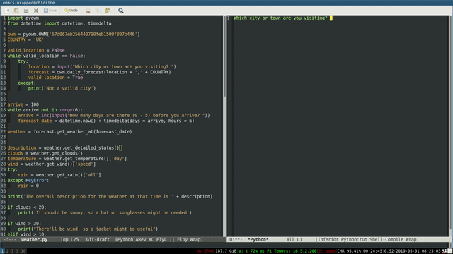
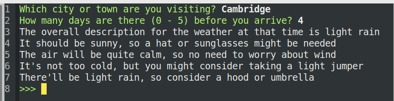

## Introduction

In this resource you're going to write a program that will allow a user to type in a city they're travelling to, and the day they'll be arriving. The program will then use [open data](https://en.wikipedia.org/wiki/Open_data) from [OpenWeatherMap](http://openweathermap.org/api) to find out what the weather is like in that city at that time, and advise the user on what they should wear when they arrive.

### What you will make

--- no-print ---

--- /no-print ---

--- print-only ---

--- /print-only ---

--- collapse ---
---
title: What you will need
---
### Hardware

+ An internet connected computer

### Software

- [Mu](https://codewith.mu/) or Python 3 with an editor of your choice
- [pyowm](https://github.com/csparpa/pyowm)

--- /collapse ---

--- collapse ---
---
title: What you will learn
---
- Know how to use the datetime module to get formatted dates
- Know how to use the pyowm to fetch weather
- Know how to use conditional selection and relational operators

This resource covers elements from the following strands of the [Raspberry Pi Digital Making Curriculum](https://www.raspberrypi.org/curriculum/):

- [Apply abstraction and decomposition to solve more complex problems](https://www.raspberrypi.org/curriculum/programming/developer)
--- /collapse ---

--- collapse ---
---
title: Additional information for educators
---

If you need to print this project, please use the [printer-friendly version](https://projects.raspberrypi.org/en/projects/dress-for-the-weather/print){:target="_blank"}.

You can [find the solution for this project here](http://rpf.io/p/en/dress-for-the-weather-get){:target="_blank"}.

--- /collapse ---
