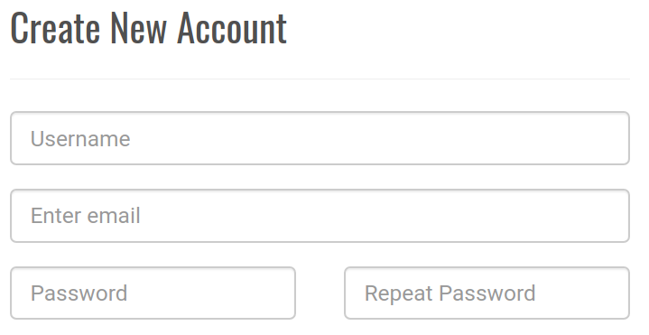
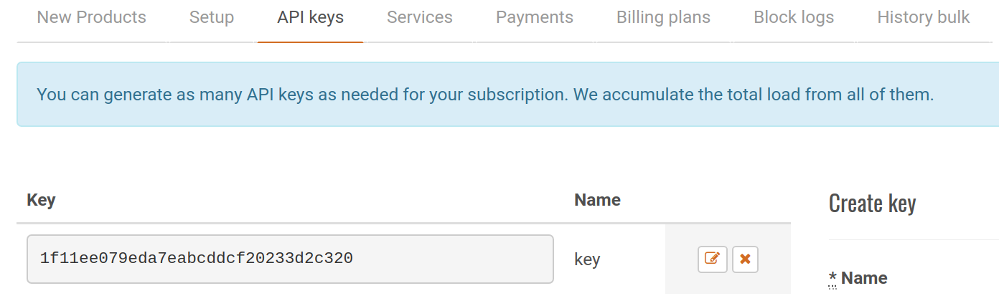

## Getting it all ready

You're going to need a Python module called **pyowm**. The easiest way to get this is to use **pip**.

[[[generic-python-installing-with-pip]]]

--- task ---
Open a terminal or command prompt and type either:

```bash
pip3 install pyowm

or

pip install pyowm
```
--- /task ---

Next, you'll need to get access to the weather forecast data. We can get the data from a site called [OpenWeatherMap](http://openweathermap.org/api).

--- task ---
Navigate to [OpenWeatherMap](http://home.openweathermap.org/users/sign_up) to sign up for a free account:



**If you are under 16 then you will need an adult to create the account for you.**
--- /task ---


After you have registered, you will can view your API keys on the site.



--- task ---
Using **Mu** or another editor of your choice, create a new file and save it as `weather.py`.


--- /task ---
	
