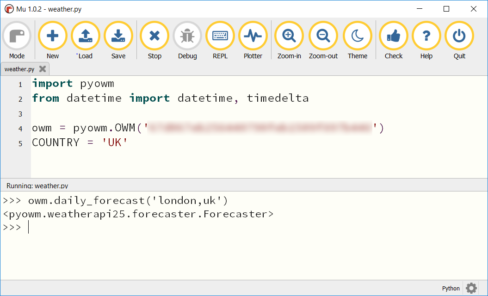

## Accessing the API

To begin with you will need to import a few modules into your program and then set your API key that you can copy and paste from the Open Weather Map website.

--- task ---
Import the pyowm and datetime modules into your program.

--- code ---
---
language: python
filename: weather.py
line_numbers: true
line_number_start: 
highlight_lines: 
---
import pyowm
from datetime import datetime, timedelta
--- /code ---
--- /task ---

--- task ---
Now set your API key and the country you live in.

--- code ---
---
language: python
filename: weather.py
line_numbers: true
line_number_start: 
highlight_lines: 4,5
---
import pyowm
from datetime import datetime, timedelta

owm = pyowm.OWM('Here is where you paste your key')
COUNTRY = 'UK'
--- /code ---
--- /task ---

--- task ---
Test that your script is working by running the code. In the interpreter, type the following line of code to test the connection to the Open Weather Maps API.

```python
owm.daily_forecast('london,uk')
```

If your code is working then you should see the following response:
```python
<pyowm.weatherapi25.forecaster.Forecaster>
```

--- /task ---
