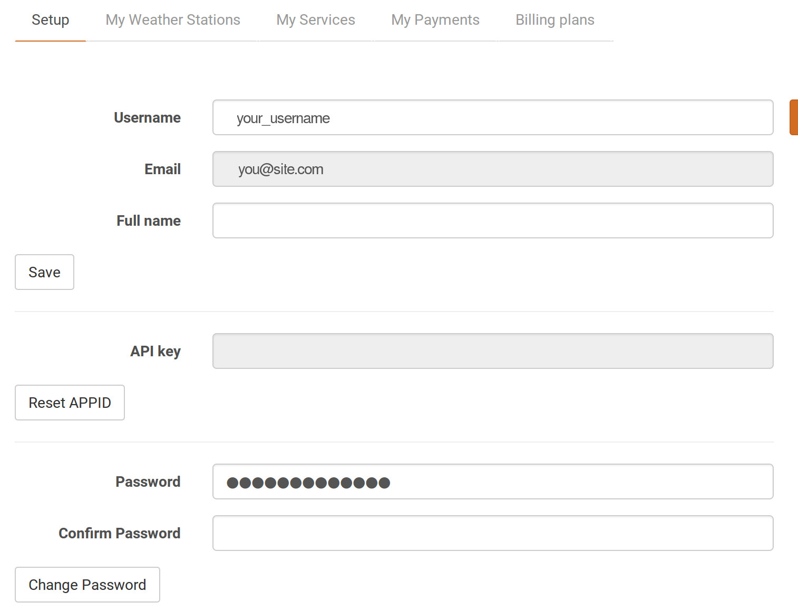

## Getting it all ready

The first thing you'll need to do is to get access to the weather forecast data. We can get the data from a site called [OpenWeatherMap](http://openweathermap.org/api).

- Navigate to [OpenWeatherMap](http://home.openweathermap.org/users/sign_up) to sign up for a free account:


- Once signed in, you can see your API key on [the dashboard](http://home.openweathermap.org/):



- You'll need a place to save your files in for this project. In your home directory, create a new directory called `dress-for-the-weather`. You can do this with the **File Explorer**, or by opening a **terminal** window and typing:

```bash
mkdir dress-for-the-weather
```

- Now, open up a new Python 3 file in your favourite editor; for instance, you can navigate to **Menu** > **Programming** > **Python3**. Create a new file (**File** > **New Window**) and save this as `weather.py` in the new directory.

- You're going to need a few modules to complete this project, so you can import them by writing the following lines of code at the top of your file:

   ```python
   from requests import get
   from datetime import datetime, timedelta
   from json import loads
   from pprint import pprint
   ```

- Next, get your API key for OpenWeatherMap and declare it as a variable in your program:

	```python
	KEY = 'paste your key in here'
	```
	
