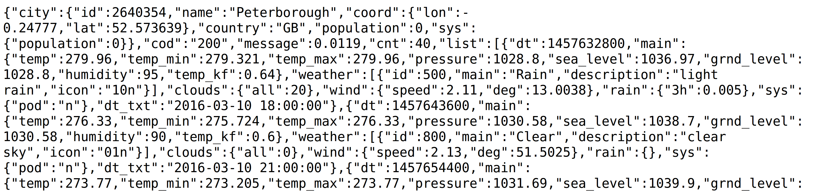

## Getting a 5-day forecast in your browser

Now that you can get the correct city ID, you have everything you need to get the weather for that location from the OpenWeatherMap API. You can get the data using a simple web request. The request you need to make must include the `city_id` and your key, placed where the `#` symbols are in the example below.

```html
http://api.openweathermap.org/data/2.5/forecast?id=######&APPID=################
```

For instance, to get the weather forecast for Peterborough, you could simply copy and paste the web address below in the URL bar of your browser, replacing the fake key at the end with your actual key.

```html
http://api.openweathermap.org/data/2.5/forecast?id=2640354&APPID=123456789abcdefghijklmnopqrstuvw
```

You should get back something that looks like this:



This might look a little confusing, but with Python you can easily examine the data.

