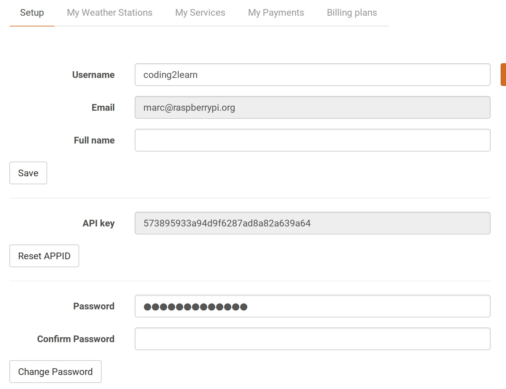

# Dress for the weather

In this resource you're going to write a program that will allow a user to type in a city they're travelling to, and the date they'll be arriving. The program will then use [open data](https://en.wikipedia.org/wiki/Open_data) to find out what the weather is like in that city at that time, and advise the user on what they should wear when they arrive.

## Getting it all ready

The first thing you'll need to do is to get access to the weather forecast data. We can get the data from a site called [OpenWeatherMap](http://openweathermap.org/api).

1. Navigate to [OpenWeatherMap](http://home.openweathermap.org/users/sign_up) to sign up for a free account:


1. Once signed in, you can see your API key on [the dashboard](http://home.openweathermap.org/):



1. You'll need a place to save your files in for this project. In your home directory, create a new directory called `dress-for-the-weather`. You can do this with the **File Explorer**, or by opening a **terminal** window and typing:

```bash
mkdir dress-for-the-weather
```

1. Now, open up a new Python 3 file in your favourite editor; for instance, you can navigate to **Menu** > **Programming** > **Python3**. Create a new file (**File** > **New Window**) and save this as `weather.py` in the new directory.

1. You're going to need a few modules to complete this project, so you can import them by writing the following lines of code at the top of your file:

   ```python
   from requests import get
   from datetime import datetime, timedelta
   from json import loads
   from pprint import pprint
   ```

1. Next, get your API key for OpenWeatherMap and declare it as a variable in your program:

	```python
	KEY = 'paste your key in here'
	```
	
## Getting a city list

1. The OpenWeatherMap API requires you to use a city ID to identify the different cities all around the world. They provide a list of city IDs in the following [linked file](http://bulk.openweathermap.org/sample/city.list.json.gz). Download the file and place it in the same directory as your code.

1. The file is compressed, so if you want to read the data you'll need to decompress it. Open a terminal and go to the `dress-for-the-weather` directory:

	```bash
	cd dress-for-the-weather
	```

1. Now check the file is there by listing the directory's contents:

	```bash
	ls
	```

    You should see the `weather.py` file and a `city.list.json.gz` file.

1. Now you can decompress the file:

```bash
gunzip city.list.json.gz
```

1. If you list the directory contents again, you should see a new file called `city.list.json`. **Don't try and open the file**; it's *really* big, and could crash your computer.

## Understanding JSON

To get the city that the person is travelling to, you first need to understand the contents of the file you have just downloaded. You can explore the file using the *shell*.

1. Save and run your `weather.py` file (`ctrl+s` and then `F5` in IDLE). In the shell, type the following command:

	```python
	cities = open('city.list.json').readlines()
	```
	
    This has loaded all the lines of the file into a huge list called `cities`.

1. To have a look at some of the items in the list, you can type the following in the shell:

	```python
	cities[0]
	```

	You should see something like this:

	```python
	>>> cities[0]
	'{"_id":707860,"name":"Hurzuf","country":"UA","coord":{"lon":34.283333,"lat":44.549999}}\n'
	```

    This is the city [Hurzuf in Ukraine](https://www.google.co.uk/maps/place/Hurzuf/@44.5472927,34.2739755,14z/data=!3m1!4b1!4m2!3m1!1s0x4094ca9c3582ba57:0xe2355b74466a46cc), and you can see its `id` is 707860.

1. What you're looking at is known as a single *JSON object*. *JSON objects* look very similar to dictionaries in Python. In fact, you can easily convert a *JSON object* to a dictionary, using the `loads` method you have imported from the `json` library. Try this in the shell:

	```python
	city = loads(cities[56325])
	```

	This has now saved the city data into a new dictionary which you can then access:

	```python
	city['name']
	city['_id']
	```

	When you type these lines, you should see output that looks like this:

	```python
	>>> city = loads(cities[56325])
	>>> city['name']
	'Peterborough'
	>>> city['_id']
	2640354
	>>> 
	```

## Getting the city ID

1. Now that you understand the nature of the *JSON* file, you can use it to find the `id` of any city in there. You can write a new function to do this, so switch back over to your `weather.py` file and add the following:

```python
def get_city_id():
```

1. The first thing to do is to load all of those `json` objects, convert each one to a dictionary, and then add them all to a huge list called `data`:

```python
def get_city_id():
    with open('city.list.json') as f:
        data = [loads(line) for line in f]
```

1. Next, you need to ask the user where they're travelling to. Just in case their city is not in the list, we'll set a variable called `city_id` to `False` as well:

	```python
	def get_city_id():
		with open('city.list.json') as f:
			data = [loads(line) for line in f]
		city = input('Which is the closest city to the place you're travelling to?' )
		city_id = False
	```

1. Now your program needs to *iterate* over every dictionary in that list, and see if the `city` the user typed in is there:

	```python
	def get_city_id():
		with open('city.list.json') as f:
			data = [loads(line) for line in f]
			city = input('Which is the closest city to the place you're travelling to?' )
		city_id = False
		for item in data:
			if item['name'] == city:
				city_id = item['_id']
		return city_id
	```

1. Run your code, and then move over into the shell to test it:

	```python
	get_city_id()
	```

1. Do you notice anything strange when you test the code with the city *Peterborough*?

	```python
	>>> get_city_id()
	Which is the closest city to the place you're travelling to? Peterborough
	5091002
	```

1. The ID `5091002` is different to the ID `2640354` you found earlier! Why could this be? You can alter your code so that it prints the `country` name, to try and debug the code:

	```python
	def get_city_id():
		with open('city.list.json') as f:
			data = [loads(line) for line in f]
			city = input('Which is the closest city to the place you're travelling to? ')
		city_id = False
		for item in data:
			if item['name'] == city:
				city_id = item['_id']
				print(item['country'])
		return city_id
	```

	```python
	>>> get_city_id()
	Which is the closest city to the place you're travelling to? Peterborough
	GB
	CA
	AU
	AU
	US
	5091002
	```

1. So there's a Peterborough in Canada, two in Australia, and another one in the United States, as well as the one in Great Britain. Your code is going to need to handle this problem by asking the user if the country is correct:

	```python
	def get_city_id():
		with open('city.list.json') as f:
			data = [loads(line) for line in f]
		city = input('Which is the closest city to the place you're travelling to?' )
		city_id = False
		for item in data:
			if item['name'] == city:
				answer = input('Is this in ' + item['country'])
				if answer == 'y':
					city_id = item['_id']
					break
		return city_id
	```

1. If the city hasn't been found then the `city_id` will still be set to `False`, so you can tell the user their city wasn't found and exit the program. The finished function should look like this:

	```python
	def get_city_id():
		with open('city.list.json') as f:
			data = [loads(line) for line in f]
		city = input('Which is the closest city to the place you're travelling to?' )
		city_id = False
		for item in data:
			if item['name'] == city:
				answer = input('Is this in ' + item['country'])
				if answer == 'y':
					city_id = item['_id']
					break

		if not city_id:
			print('Sorry, that location is not available')
			exit()

		return city_id
	```

## Getting a 5-day forecast in your browser

Now that you can get the correct city ID, you have everything you need to get the weather for that location from the OpenWeatherMap API. You can get the data using a simple web request. The request you need to make must include the `city_id` and your key, placed where the `#` symbols are in the example below.

```html
http://api.openweathermap.org/data/2.5/forecast?id=######&APPID=################
```

For instance, to get the weather forecast for Peterborough, you could simply copy and paste the web address below in the URL bar of your browser, replacing the fake key at the end with your actual key.

```html
http://api.openweathermap.org/data/2.5/forecast?id=2640354&APPID=123456789abcdefghijklmnopqrstuvw
```

You should get back something that looks like this:


This might look a little confusing, but with Python you can easily examine the data.

## Getting a 5-day forecast with Python

1. The `get` method that you have already imported from the `requests` module is all you need to access data from the web. Start by defining a new function that takes the `city_id` as an argument:

	```python
	def get_weather_data(city_id):
	```

1. Then you can use string formatting to compose the *URL*:

	```python
	def get_weather_data(city_id):
		weather_data = get('http://api.openweathermap.org/data/2.5/forecast?id={}&APPID={}'.format(city_id, KEY))
	```

    Here the curly brackets `{}` within the URL are replaced with whatever is in the brackets after `.format`.

1. The data that your program downloads is just a long string. You can convert it to *JSON* easily enough, though, and return it:

```python
def get_weather_data(city_id):
    weather_data = get('http://api.openweathermap.org/data/2.5/forecast?id={}&APPID={}'.format(city_id, KEY))
    return weather_data.json()
```

## Looking at the data

To use the data you've just downloaded, you'll need to understand its nature.

1. Save and run your code, then move into the shell and type the following:

	```python
	weather = get_weather_data('2640354')
	```

    This get the weather data for Peterborough.

1. To look at the data, you can type the following into the shell:

	```python
	weather
	```

1. That's quite a big dictionary and very confusing to look at. Fortunately, you've imported the **pretty print** method called `pprint` that will help make more sense of the data:

	```python
	pprint(weather)
	```

    Here's what the first few lines should look like:

	```python
	>>> weather = get_weather_data("2640354")
	>>> pprint(weather)
	{'city': {'coord': {'lat': 52.573639, 'lon': -0.24777},
			  'country': 'GB',
			  'id': 2640354,
			  'name': 'Peterborough',
			  'population': 0,
			  'sys': {'population': 0}},
	 'cnt': 37,
	 'cod': '200',
	 'list': [{'clouds': {'all': 8},
			   'dt': 1457697600,
			   'dt_txt': '2016-03-11 12:00:00',
			   'main': {'grnd_level': 1034.12,
						'humidity': 100,
						'pressure': 1034.12,
						'sea_level': 1042.16,
						'temp': 284.67,
						'temp_kf': 4.43,
						'temp_max': 284.67,
						'temp_min': 280.241},
			   'rain': {},
			   'sys': {'pod': 'd'},
			   'weather': [{'description': 'clear sky',
							'icon': '02d',
							'id': 800,
							'main': 'Clear'}],
			   'wind': {'deg': 145.004, 'speed': 2.47}},
	```

1. The dictionary has a key in it called `list` on line 9. You can look at this section of the dictionary by typing the following:

	```python
	pprint(weather['list'])
	```

1. That's still pretty big, so have a look at the *zeroth* item in the list:

	```python
	pprint(weather['list'][0])
	```

1. That should be a little smaller, and look something like this:

	```json
	{'clouds': {'all': 8},
	 'dt': 1457697600,
	 'dt_txt': '2016-03-11 12:00:00',
	 'main': {'grnd_level': 1034.12,
			  'humidity': 100,
			  'pressure': 1034.12,
			  'sea_level': 1042.16,
			  'temp': 284.67,
			  'temp_kf': 4.43,
			  'temp_max': 284.67,
			  'temp_min': 280.241},
	 'rain': {},
	 'sys': {'pod': 'd'},
	 'weather': [{'description': 'clear sky',
				  'icon': '02d',
				  'id': 800,
				  'main': 'Clear'}],
	 'wind': {'deg': 145.004, 'speed': 2.47}}
	 ```

    It will be different for you, as you're accessing the weather forecast at a different time.

1. What you have here is a dictionary containing weather data. This dictionary has a few keys in it, but for now the most important one is `dt_txt`. You can look at this by typing the following:

	```python
	weather['list'][0]['dt_txt']
	```

1. Now have a look at the next item in `'list'`:

	```python
	weather['list'][1]['dt_txt']
	```

1. You should see that the two strings returned are dates and times that are three hours apart. That is what `list` contains: a list of predicted weather data for 5 days, each three hours apart. So to know what the user should wear, you're going to need the time and date they're getting to the city.

## What next?

Continue on to [Worksheet 2](worksheet2.md) to learn how.
